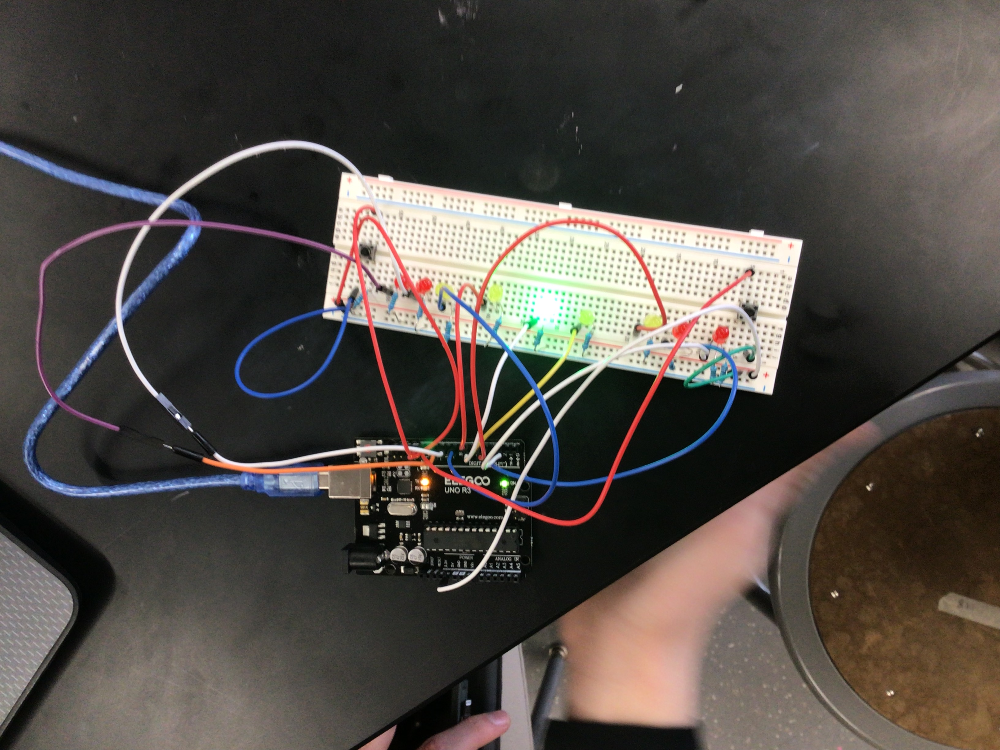

# Chapter 5 Project
## Project Description
Push Button game that includes LEDS

## Project Code
```
int rightbutton = 12;
int leftbutton = 13;
int leftred = 2;
int leftred1 = 3;
int leftyellow = 4;
int leftyellow1 = 5;
int green = 6;
int rightyellow1 = 7;
int rightyellow = 8;
int rightred1 = 9;
int rightred = 10;
bool LBS;
bool RBS;

int score = 0;
void setup() {
  pinMode (rightbutton, INPUT);
  pinMode (leftbutton, INPUT);
  pinMode (leftred, OUTPUT);
  pinMode (leftred1, OUTPUT);
  pinMode (leftyellow, OUTPUT);
  pinMode (leftyellow1, OUTPUT);
  pinMode (green, OUTPUT);
  pinMode (rightyellow1, OUTPUT);
  pinMode (rightyellow, OUTPUT);
  pinMode (rightred1, OUTPUT);
  pinMode (rightred, OUTPUT);
  digitalWrite (rightred, LOW);
  digitalWrite (rightred1, LOW);
  digitalWrite (rightyellow, LOW);
  digitalWrite (rightyellow1, LOW);
  digitalWrite (green, HIGH);
  digitalWrite (leftyellow1, LOW);
  digitalWrite (leftyellow, LOW);
  digitalWrite (leftred1, LOW);
  digitalWrite (leftred, LOW);
  Serial.begin(9600);
}
bool debounceLeft = true;
bool debounceRight = true;

void loop() {
 Serial.println(score);
  
  LBS = digitalRead(leftbutton);
  if(LBS == HIGH && debounceLeft == true){
    debounceLeft = false;
    score = score + 1;
  }
  RBS = digitalRead(rightbutton);
  if(RBS == HIGH && debounceRight == true){
    debounceRight = false;
    score = score - 1;
  }

  if (LBS != HIGH) {
    debounceLeft = true;
  }

  if (RBS != HIGH) {
    debounceRight = true;
  }
  
  if(score == 0){
    digitalWrite(green, HIGH);
  } else {digitalWrite(green, LOW);}

//Right Side
  
  if(score < 0 && score > -5){
    digitalWrite(rightyellow1, HIGH);
  } else { digitalWrite(rightyellow1, LOW);}
  
  if(score < -5 && score > -10){
    digitalWrite(rightyellow, HIGH);
  } else {digitalWrite(rightyellow, LOW);}
  
  if(score < -10 && score > -15){
    digitalWrite(rightred1, HIGH);
  } else {digitalWrite(rightred1, LOW);}
  
  if(score < -15){
    digitalWrite(rightred, HIGH);
  } else {digitalWrite(rightred, LOW);}

// Left Side
 if(score > 0 && score < 5){
    digitalWrite(leftyellow1, HIGH);
  } else { digitalWrite(leftyellow1, LOW);}
  
  if(score > 5 && score < 10){
    digitalWrite(leftyellow, HIGH);
  } else {digitalWrite(leftyellow, LOW);}
  
  if(score > 10 && score < 15){
    digitalWrite(leftred1, HIGH);
  } else {digitalWrite(leftred1, LOW);}
  
  if(score > 15){
    digitalWrite(leftred, HIGH);
  } else {digitalWrite(leftred, LOW);}
}
~~~

## Project Visuals

![Video of Game](
