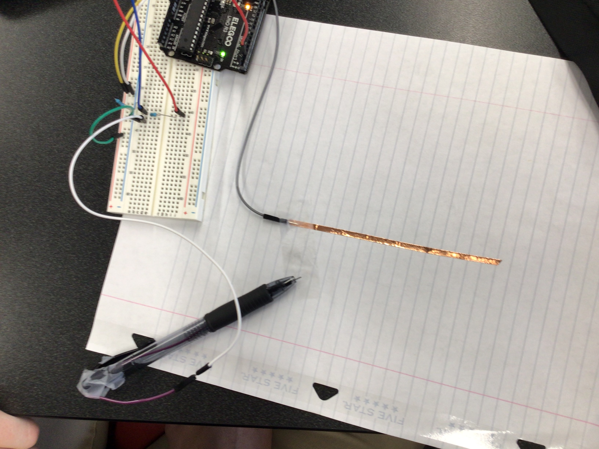
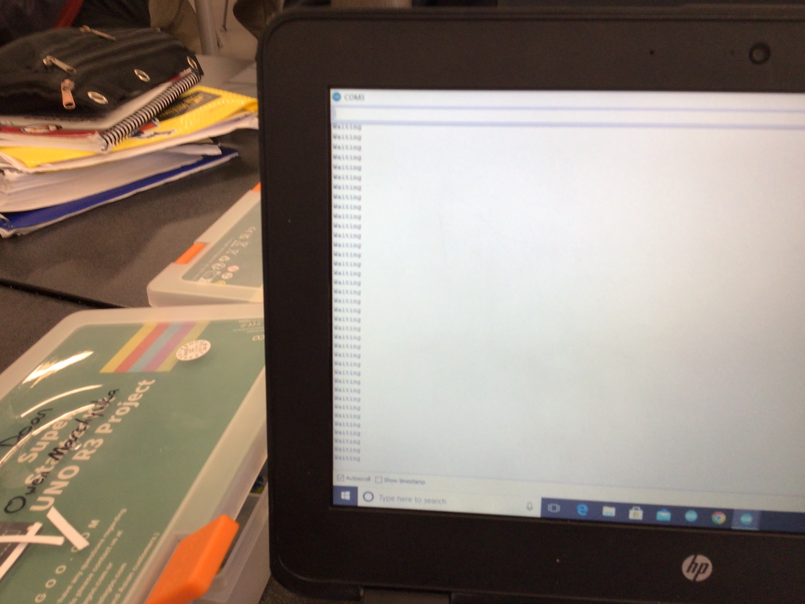
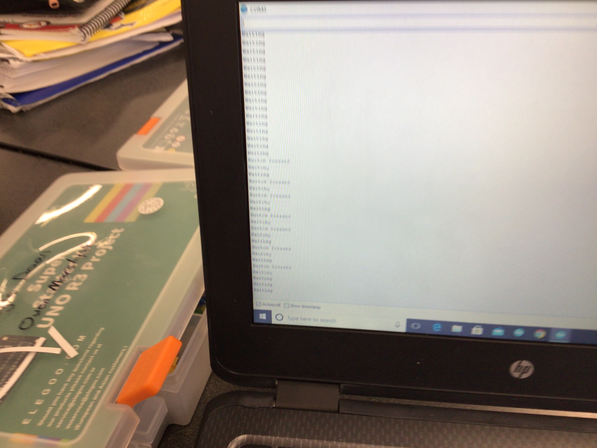

# Interesting Push Button
## Project Description
push button using a pen and copper tape

## Project Code
```
int buttonPin = 2;
int buttonState = 0;

void setup() {
  Serial.begin(9600);
  pinMode(buttonPin, INPUT);
  }

void loop() {
  delay(100);
  buttonState = digitalRead(buttonPin);
  if(buttonState == HIGH){
  Serial.println("Button Pressed");
  } else{
    Serial.println("Waiting");
  }
  }
```
## Project Visuals






